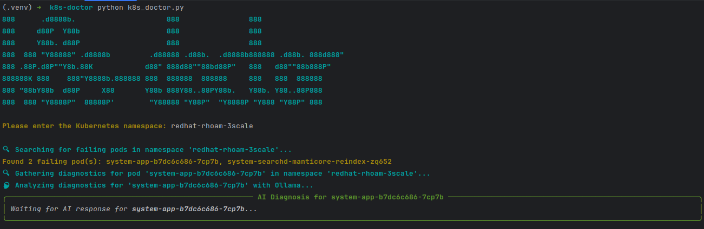

# K8s-Doctor: AI-Powered Kubernetes Pod Troubleshooter



K8s-Doctor is a command-line tool that automates the process of troubleshooting failing Kubernetes pods. 
It intelligently identifies pods in a non-healthy state, gathers all relevant diagnostic data (`describe`, `logs`, `events`),
and uses a local AI model via Ollama to provide a root cause analysis and a suggested next step.

## Prerequisites

Before you begin, ensure you have the following installed and configured:

1.  **Python 3**: The script is written in Python.
2.  **`kubectl`**: Must be installed and configured with access to your Kubernetes cluster (`~/.kube/config`).
3.  **Ollama**: You need a local instance of [Ollama](https://ollama.com/) running.
4.  **Ollama Model**: The `llama3` model must be pulled. You can get it by running:
    ```bash
    ollama pull llama3
    ollama run llama3
    ```

## Installation

1.  **Clone the Project**: `git clone github.com/austincunningham/k8s-doctor.py`
2.  **Install Python Libraries**: The script requires the `requests` and `rich` libraries. Install them using pip:
    ```bash
    pip install requests rich
    ```

## Usage

You can run the script in two ways:

**1. Provide the namespace as an argument:**

```bash
python k8s-doctor.py --namespace my-failing-namespace
```

**2. Run without arguments for an interactive prompt:**

The script will ask you to enter the namespace.


## How It Works

The script follows a simple yet powerful workflow:

1.  **Find Failing Pods**: It calls `kubectl get pods -o json` and intelligently parses the output to identify any pod whose `phase` is not `Running` or `Succeeded`, or any pod that is `Running` but has containers that are not ready or have terminated unexpectedly.
2.  **Gather Diagnostics**: For each pod identified, it runs a series of `kubectl` commands (`describe`, `logs`, `logs --previous`, `get events`) to collect a complete diagnostic picture.
3.  **Analyze with AI**: It constructs a detailed prompt containing all the gathered information and sends it to the Ollama API's `/api/generate` endpoint.
4.  **Stream and Display**: The response from the AI is streamed back to the console and printed inside a clean, bordered panel, providing an immediate and readable diagnosis for each failing pod.

---

*This tool is intended for diagnostic purposes and should be used with an understanding of the cluster and its workloads.*
